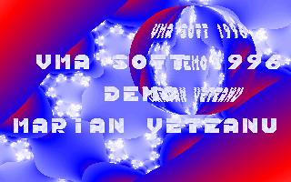

MCGA 1.44
=========

Last update: 1996

MCGA is a Turbo Pascal for DOS library for implementing fast 256 color games.
MCGA is optimized for speed with x386 assembler code.

Features
--------

- graphic primitives (circle, line, etc.)
- unlimited virtual screens
- double buffering support
- x386 assembler optimizations
- 256 color support
- sprite support
- pallete effects (rotate pallete, etc.)

Source code
-----------

The source code of MCGA library is mainly located in [src/MCGA.PAS](src/MCGA.PAS) unit.

Note: The MCGA library uses partial code from PC-GPA and other unknown sources.
Thanks also to Marian Olteanu for contributing and doing some x386 optimizations.

VMA

